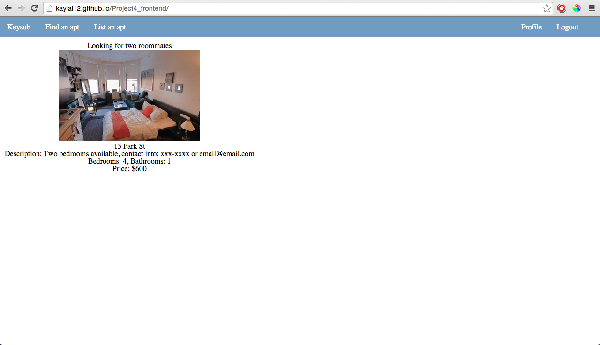

# PROJECT 4

KeySub: a website that allows users find roommates and/or sublet in Boston.
Frontend build with js, jquery, ajax, and handlebars.

# USER STORIES

As a new user:
-I can see all listings.
-I can sign up.

As a registered user:
-I can log in.
-I can see my profile, with my listings
-I can see all listings.
-I can create a new listings
-I can update my profile with a description
-I can delete a listing.

REACH GOALS:
-implement Google map api
-create search function to look through listings.

# PROCESS
I first started this project with planning, creating user stories and wireframes. The basic layout of the page was then created using the wireframes.
AJAX was then used to make http requests to the server. Js and jQuery were used to create the click handlers that would fire the AJAX requests.
For the first time, I implemented Handlebars which helped me create templates to show the data that I get from my backend.

# UNSOLVED PROBLEMS
Update currently does update in the database, but does not show up when saving the update (must get the page again in order to see the changes).

[Backend_Repo](https://github.com/kaylal12/Project4_backend);

[KeySub](http://kaylal12.github.io/Project4_frontend/);
